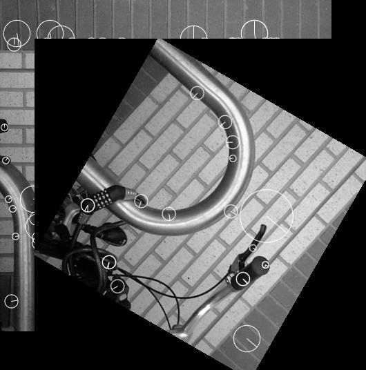

# Pure C# Implementation of SIFT (Scaled Invariant Feature Transform)

Find local features using [SIFT](https://en.wikipedia.org/wiki/Scale-invariant_feature_transform)





Based on code from:<br/>
  * https://github.com/karashiiro/SIFT
  * https://github.com/karashiiro/GradientDotNet


## Prerequisites

* .NET9 SDK


## Getting started

```bash
git clone https://github.com/TrevorDArcyEvans/SIFT.git
cd SIFT
dotnet restore
dotnet build
dotnet run
```


