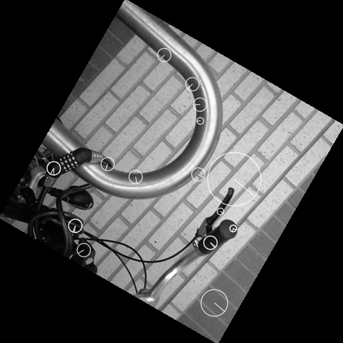

# Pure C# Implementation of SIFT (Scaled Invariant Feature Transform)

Find local features using [SIFT](https://en.wikipedia.org/wiki/Scale-invariant_feature_transform)

<details>

<br/>
Baseline = image from https://upload.wikimedia.org/wikipedia/commons/3/3f/Bikesgray.jpg
<br/>

<br/>
Left = Baseline + cropped
<br/>

<br/>
Right = Baseline cropped + rotated
<br/>

<br/>
Keypoints Left
<br/>

<br/>
Keypoints Right
<br/>

<br/>
Corrected Right = Keypoints Right + rotated + scaled
<br/>

<br/>
Corrected = Corrected Right + merged + Keypoints Left
<br/>

Based on code from:<br/>

* https://github.com/karashiiro/SIFT
* https://github.com/karashiiro/GradientDotNet

</details>

## Prerequisites

* .NET9 SDK

## Getting started

```bash
git clone --recurse-submodules https://github.com/TrevorDArcyEvans/SIFT.git
cd SIFT
dotnet restore
dotnet build
cd SIFT.Demo
dotnet run

# examine contents of current directory
```

## Using SIFT to recognise features

<details>

### Results

The following images are from the card game [Dobble](https://en.wikipedia.org/wiki/Dobble).

As seen the two cards have a *carrot* in common.


Here are the same images but with keypoints added:


### Further results

| Image                                 | Keypoints                                       |
|---------------------------------------|-------------------------------------------------|
|           |           |
|       |       |
|  |  |

### Discussion

As should be obvious, keypoint identification is not consistent between images.  This may
be due to inconsistent lighting between images.

Further, some *Dobble* items are not detected at all eg spider web, dolphin, sunflower, water drop.
This may be because these items do not have enough contrast.

### Conclusion

At this stage, SIFT is just too inconsistent and unreliable to use for feature recognition.

</details>

## Further work

* update *SIFT.UI.CLI* to output keypoints to CSV or JSON
* verify SIFT algorithm against other implementations eg OpenCV
